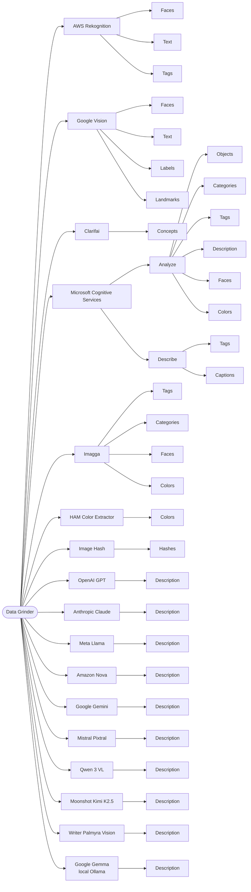

# Data Grinder — Services & Features

The services Data Grinder can run an image through, and the features each one returns.

```mermaid
flowchart LR
    DG([Data Grinder])

    %% ── Computer vision services ──────────────────────────────
    DG --> AWS[AWS Rekognition]
    AWS --> AWS_Faces[Faces]
    AWS --> AWS_Text[Text]
    AWS --> AWS_Tags[Tags]

    DG --> GV[Google Vision]
    GV --> GV_Faces[Faces]
    GV --> GV_Text[Text]
    GV --> GV_Labels[Labels]
    GV --> GV_Landmarks[Landmarks]

    DG --> CL[Clarifai]
    CL --> CL_Concepts[Concepts]

    DG --> MCS[Microsoft Cognitive Services]
    MCS --> MCS_Analyze[Analyze]
    MCS --> MCS_Describe[Describe]
    MCS_Analyze --> MA_Objects[Objects]
    MCS_Analyze --> MA_Categories[Categories]
    MCS_Analyze --> MA_Tags[Tags]
    MCS_Analyze --> MA_Description[Description]
    MCS_Analyze --> MA_Faces[Faces]
    MCS_Analyze --> MA_Colors[Colors]
    MCS_Describe --> MD_Tags[Tags]
    MCS_Describe --> MD_Captions[Captions]

    DG --> IM[Imagga]
    IM --> IM_Tags[Tags]
    IM --> IM_Categories[Categories]
    IM --> IM_Faces[Faces]
    IM --> IM_Colors[Colors]

    DG --> HAM[HAM Color Extractor]
    HAM --> HAM_Colors[Colors]

    DG --> IH[Image Hash]
    IH --> IH_Hashes[Hashes]

    %% ── LLM / vision-language description services ─────────────
    DG --> GPT[OpenAI GPT]
    GPT --> GPT_Desc[Description]

    DG --> CLAUDE[Anthropic Claude]
    CLAUDE --> CLAUDE_Desc[Description]

    DG --> LLAMA[Meta Llama]
    LLAMA --> LLAMA_Desc[Description]

    DG --> NOVA[Amazon Nova]
    NOVA --> NOVA_Desc[Description]

    DG --> GEMINI[Google Gemini]
    GEMINI --> GEMINI_Desc[Description]

    DG --> PIXTRAL[Mistral Pixtral]
    PIXTRAL --> PIXTRAL_Desc[Description]

    DG --> QWEN[Qwen 3 VL]
    QWEN --> QWEN_Desc[Description]

    DG --> KIMI[Moonshot Kimi K2.5]
    KIMI --> KIMI_Desc[Description]

    DG --> PALMYRA[Writer Palmyra Vision]
    PALMYRA --> PALMYRA_Desc[Description]

    DG --> GEMMA[Google Gemma<br/>local Ollama]
    GEMMA --> GEMMA_Desc[Description]

```
